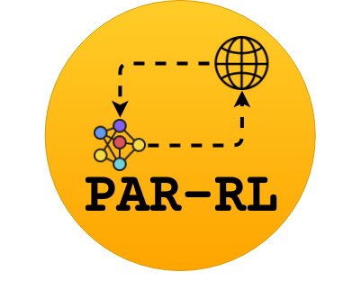

# PAR-RL

<p align="center">
		
	</p>
  
Scaling RLLib for generic simulation environments on Theta at Argonne Leadership Computing Facility.

## Core-team
[Suraj Pawar](https://surajp92.github.io/) & [Romit Maulik](https://romit-maulik.github.io/)

## Dependencies
1. Tensorflow 1.14.0
2. Gym 0.17.1
3. Ray 0.7.6 - Install with `pip install ray[rllib]==0.7.6`
4. Numpy 1.16.1

## How to setup your own RLLib environment on Theta

The user can setup a seprate environment for RLLib and all the requirements as follows:

1. Before creating your environment, the use needs to load some modules. Add the below modules in your `.bashrc` file:
```
module load miniconda-3.6/conda-4.5.12
module load intelpython36
```
and then executre `source .bashrc`

2. In the terminal client enter the following where *yourenvname* is the name you want to call your environment, and replace *x.x* with the Python version you wish to use. We have tested with 3.6.8 version of the Python.
```
conda create -n yourenvname python=x.x 
```

3. Install all the requirements with 
```
pip install -r requirements.txt
```

4. To use RLLib on Theta, the user needs to install MPI using the script provided in `install_mpi` folder. Go inside the `install_mpi` folder and execute
```
bash install_mpi4py.sh
```

5. To activate or switch into your virtual environment, simply type the following where *yourenvname* is the name you gave to your environement at creation.
```
source activate yourenvname
```

# How to run

The idea is as follows:

1. Start ray on the head node and retrieve the `head_redis_address` by running
```
ray start --num_cpus 1 --redis-port=10100
```
note that the `--num_cpus` argument may vary from machine to machine.

2. Start workers on other nodes by running
```
ray start --num_cpus 1 --address={head_redis_address}
```
where `head_redis_address` is obtained after the head node process is started. If this is successfully executed - you are good to execute RLLib in a distributed fashion. Change `--num_cpus` argument for more ranks on one compute node.

3. Within your python script which executes RLLib you must have a statement
```
import ray
import argparse

parser = argparse.ArgumentParser()
parser.add_argument("--ray-address")
args = parser.parse_args()
ray.init(address=args.ray_address)
```
which lets you call the script (in our following MWE this will be `train_ppo.py`) as `python train_ppo.py --ray-address head_redis_address`. An important point here is that this must be called on the head node alone and the RL workers will be automatically distributed (the beauty of Ray/RLLib). 

4. All this business can be packaged quite effectively using `start_ray.py` which uses subprocess to call `train_ppo.py`. For an example see [here](https://github.com/Romit-Maulik/PAR-RL/blob/master/cartpole/start_ray.py).

5. This distributed RL runs without any trouble at all on my laptop for 4 workers and can be called by running `mpirun -np 4 python start_ray.py`

## Running on Theta compute nodes

Execute the same procedure by running an interactive job on Theta using
```
qsub -A datascience -t 60 -q debug-cache-quad -n 2 -I
```
and using aprun as `aprun -n 4 -N 2 python start_ray.py`. The logs for starting ray (at `start_ray.log`) show success:

```
05/01/2020 07:36:14 PM | Waiting for broadcast...
05/01/2020 07:36:14 PM | Waiting for broadcast...
05/01/2020 07:36:14 PM | Waiting for broadcast...
05/01/2020 07:36:14 PM | Ready to run ray head
05/01/2020 07:36:25 PM | Head started at: 10.128.15.16:6379
05/01/2020 07:36:25 PM | Ready to broadcast head_redis_address: 10.128.15.16:6379
05/01/2020 07:36:25 PM | Broadcast done... received head_redis_address= 10.128.15.16:6379
05/01/2020 07:36:25 PM | Broadcast done... received head_redis_address= 10.128.15.16:6379
05/01/2020 07:36:25 PM | Broadcast done...
05/01/2020 07:36:25 PM | Broadcast done... received head_redis_address= 10.128.15.16:6379
05/01/2020 07:36:25 PM | Waiting for workers to start...
05/01/2020 07:36:25 PM | Worker on rank 3 with ip 10.128.15.16 will connect to head-redis-address=10.128.15.16:6379
05/01/2020 07:36:25 PM | Worker on rank 2 with ip 10.128.15.16 will connect to head-redis-address=10.128.15.16:6379
05/01/2020 07:36:25 PM | Worker on rank 1 with ip 10.128.15.16 will connect to head-redis-address=10.128.15.16:6379
05/01/2020 07:36:32 PM | Worker on rank 3 with ip 10.128.15.16 is connected!
05/01/2020 07:36:32 PM | Worker on rank 2 with ip 10.128.15.16 is connected!
05/01/2020 07:36:33 PM | Worker on rank 1 with ip 10.128.15.16 is connected!
05/01/2020 07:36:33 PM | Workers are all running!
05/01/2020 07:36:33 PM | Ready to start driver!
```

