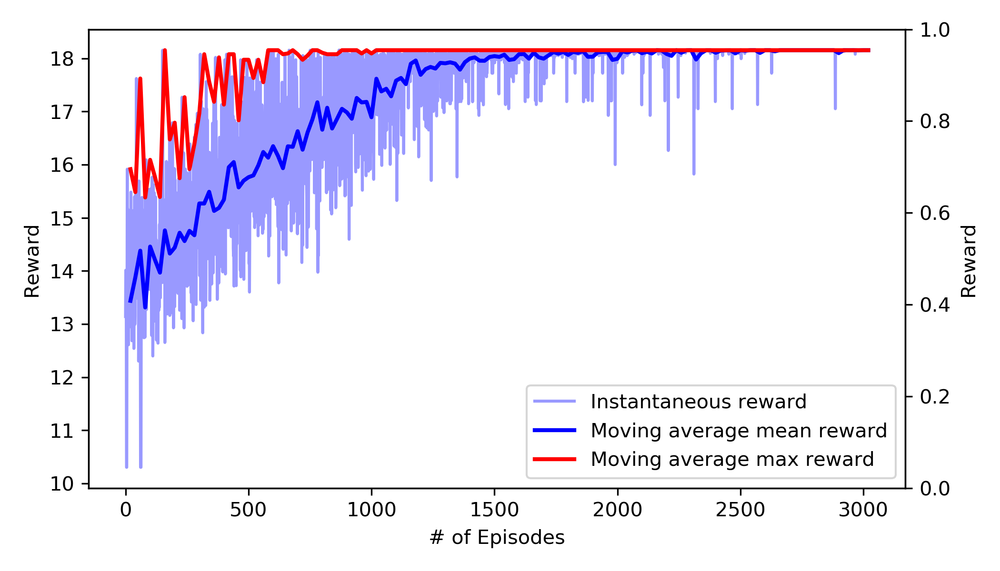
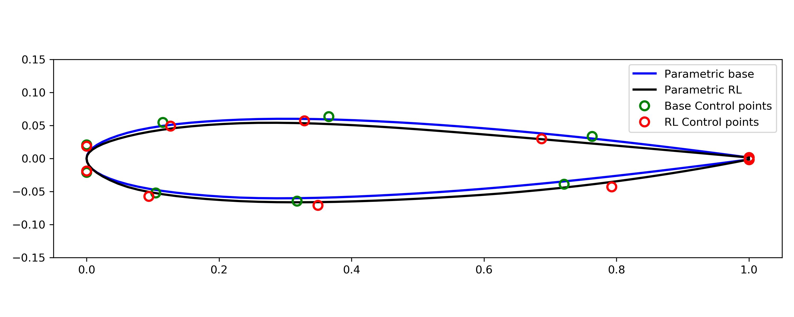

# Shape optimization
In this test case, we use single step PPO algorithm to optimize aerodynamic shape. The framework is developed for shape optimization of NACA 0012 airfoil with an objective to maximize lift to drag ratio. 

## To do: Validate CFD model with experimental data 

## Problem formulation
The MDP problem for this test case is formulated as below
- The airfoil shape is parameterized using the bezier cure with 6 control points. There are total 13 control parameters which includes the x and y co-ordinates of 6 control points and the leading edge radius. The action at each time step is the selection of 13 control points. 
	<p align="center">
		
	</p>

- The inlet velocity is used as the state of the system. Since, each episode is comprised of only one time step, the agent sees the same state throughout the training. 
	<p align="center">
		
	</p>

- The reward is computed as the ratio of lift coefficient to the drag coefficient. The constraint such as constant lift coefficient can be taken into account by adding a penalty function to the reward function.
	<p align="center">
		
	</p>

## Results
- The agent is trained using the PPO agorithm for 3000 episodes. The histroy of instantaneous, moving average maximum, and moving average mean reward is shown in the below Figure.
	<p align="center">
		
	</p>

- There Figure below shows the shape of original NACA 0012 airfoil and optimizes airfoil along with control points for each geometry.
	<p align="center">
		
	</p>

## Running OpenFoam with RLLib


## Running the code
The job can be submitted on Theta either in the `debug` or `default` mode. Job submission scripts are provided for both `debug` or `default` mode. The user has to specify the project name and RLLib environment in job submission scripts before submitting it. To submit the job in `debug` mode on Theta execute 
```
qsub ray_python_debug.sh
```

## Relevant research articles

