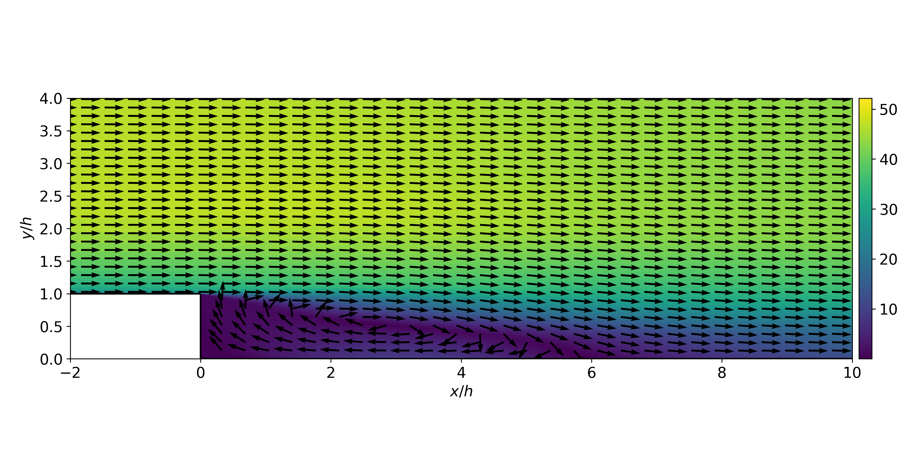
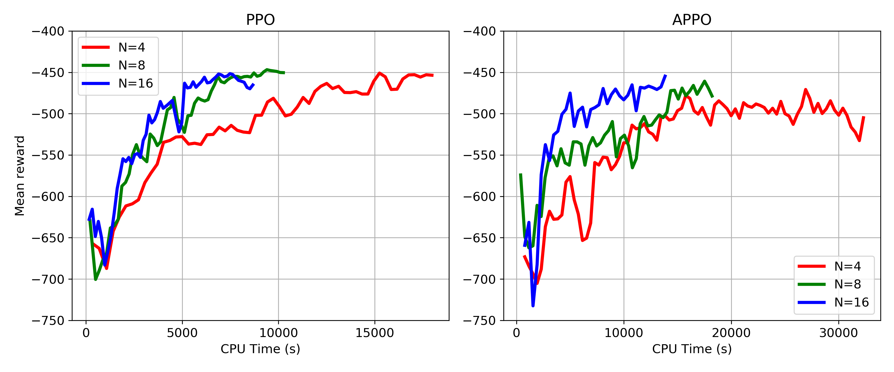
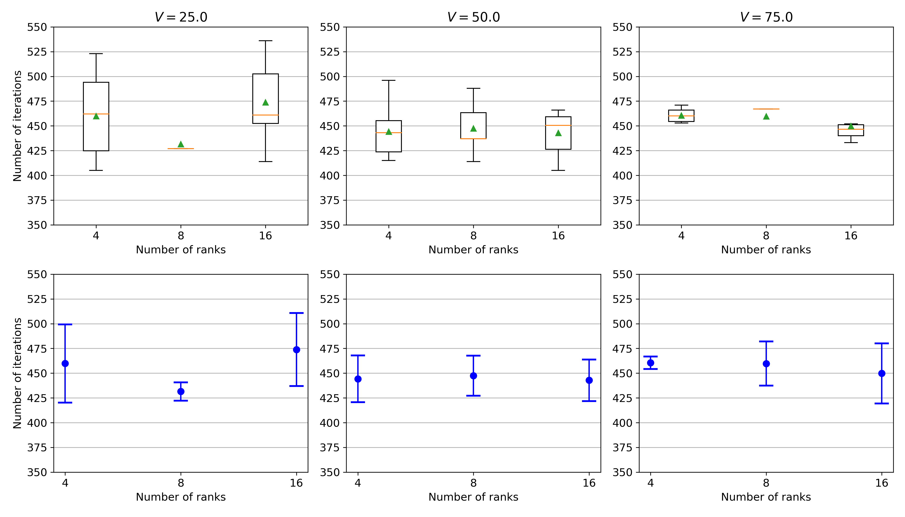
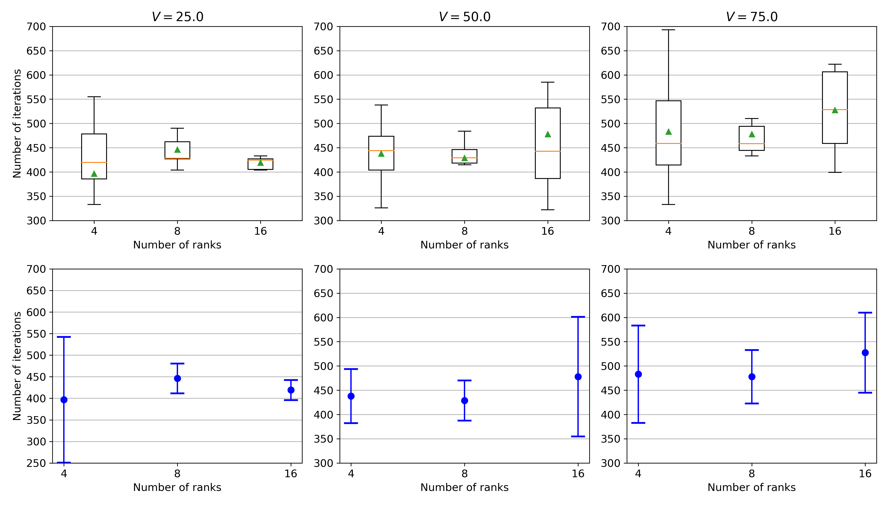

# Accelerating CFD solvers

In this test case, we try to check the feasibility of RL to dynamically update underrelaxation factors in CFD solvers to accelerate the convergence in CFD simulations of turbulent flows. We test our framework for the backward facing step examples where an agent is trained for different inlet velocities. The underrelaxation factors for velocity and pressure are updated after every n iterations of CFD simulation.

	

## Problem formulation

The MDP problem for this test case is formulated as below
- The state of the system is the sume of average value of the square of the velocity at the inlet boundary and in the internal mesh.   
	

		
	

	
- The agent chooses the underrelaxation factor for discretized momentum and pressure equation.
	

		
	

	
- The reward is the total number of iterations it took for the CFD simulations to converge
	

		
	

## Results

- We implemet proxymal policy optimization (PPO) and asynchronous proxymal policy optimization (APPO) for this test case. The PPO agent is trained for 2000 episodes and the APPO agent is trained for 3500 eisodes for different number of workers. 

	

- Once the agent is trained, it is tested for three different values of inlet velocities, V = 25.0, 50.0, 75.0 m/s. The boxplot and errorbar plot for the PPO algorithm is shown below.

	

The boxplot and errorbar plot for the APPO algorithm is shown below.

	

## Running the code

## Relevant research articles
