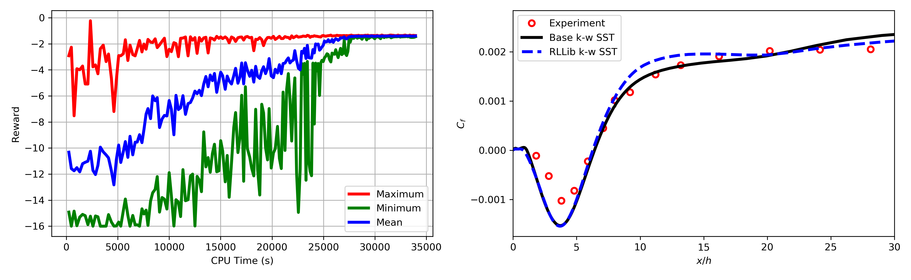
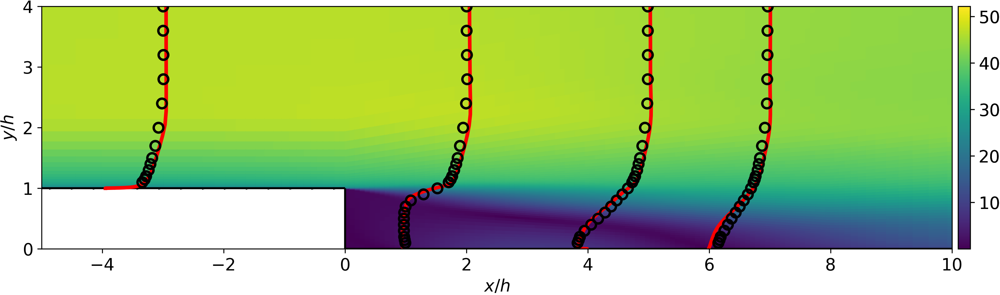

# Turbulent model calibration
In this test case, we calibrate the closure coefficients of the Reynolds-averaged Navier–Stokes (RANS) K-w SST turbulent model based on the experimental measurements data. The automated computational framework is validated with the turbulet flow in a backward facing step example. 

## Problem formulation
The MDP problem for this test case is formulated as below
- The agent select the closure coefficient one by one. Therefore, the action at each time step is a selection of one closure coefficients. 
	<p align="center">
		
	</p>

- We treat the selection of closure coefficients as a sequential decision process. Therefore, the selection of the closure coefficient at a current time step act as a state of the system for next time step. 
	<p align="center">
		
	</p>

- The reward is computed based on the square of the relative errors between the experimental data and the data obtained from CFD simulations. The CFD simulation is run only once after all closure coefficients are selected and hence the reward is assigned only for the last time step of an episode. 
	<p align="center">
		
	</p>

## Results
- The agent is trained using the PPO agorithm. The Figure below shows that the maximum, minimum, and mean reward has converged to a single distribution. The right plot shows that the skin friction coefficient for CFD simulation with closure coefficients selected by an RL agent is similar to the base turbulent model.
	<p align="center">
		
	</p>

- There Figure below shows that there is a good agreement between experimental data for velocity and CFD simulation with learned closure coefficients.
	<p align="center">
		
	</p>

## Running the code
The job can be submitted on Theta either in the `debug` or `default` mode. Job submission scripts are provided for both `debug` or `default` mode. The user has to specify the project name and RLLib environment in job submission scripts before submitting it. To submit the job in `debug` mode on Theta execute 
```
qsub ray_python_debug.sh
```

## Relevant research articles
[On the Use of Optimization Techniques for Turbulence Model Calibration](https://ntrs.nasa.gov/archive/nasa/casi.ntrs.nasa.gov/20190025296.pdf)

[A data-driven adaptive Reynolds-averaged Navier–Stokes k–ω model for turbulent flow](https://www.sciencedirect.com/science/article/pii/S0021999117303789)

[Optimization of Parameter Values in the Turbulence Model Aided by Data Assimilation](https://arc.aiaa.org/doi/abs/10.2514/1.J054109?journalCode=aiaaj)

[Efficient hyperparameter optimization through model-based reinforcement learning](https://www.sciencedirect.com/science/article/pii/S0925231220310523)
