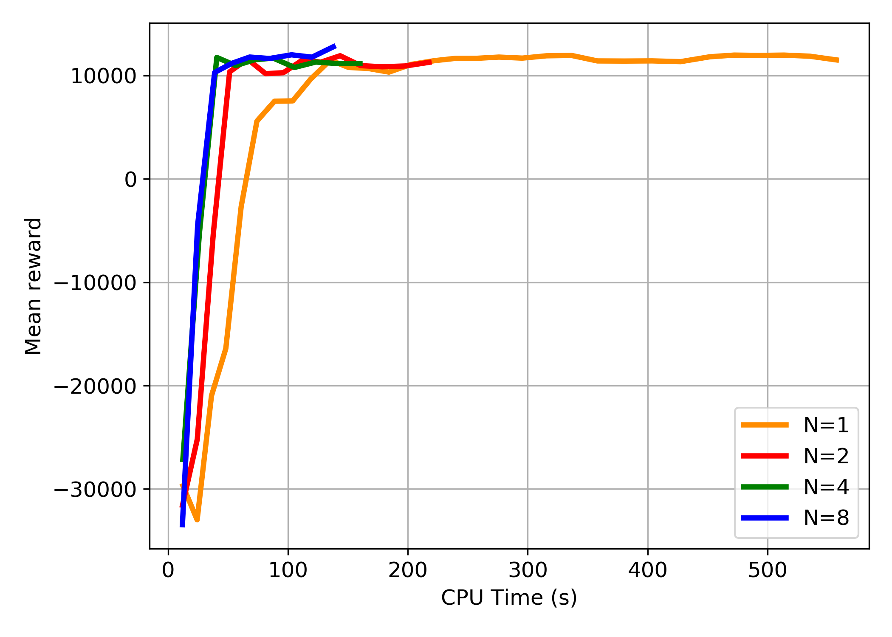
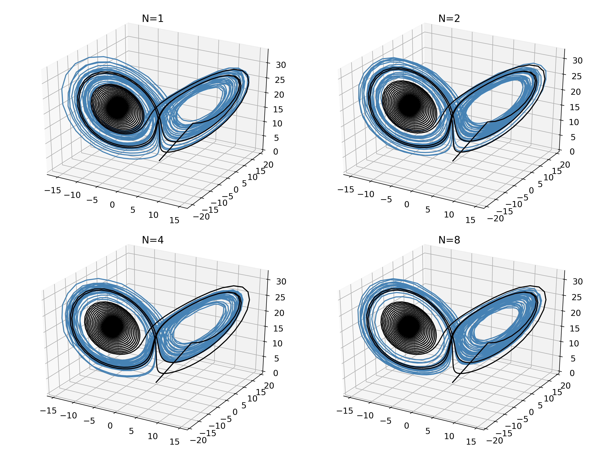

# Lorenz system
In this test case, the chaos is mantained in the Lorenz system by controlling its parameters based on the magnitude of the velocity. 

## Problem formulation

The MDP problem for this test case is formulated as below
- The state of the system consists of the coordinates of the Lorenz sysytem and their first order derivative.   
	<p align="center">
		
	</p>
	
- The agent chooses the perturbation in the parameters of the Lorenz system as action to keep the system chaotic.
	<p align="center">
		
	</p>
	
- The stepwise reward is assigned based on the magnitude of the velocity (). Additionally, the teminal reward is assigned based on the avergae reward () over last 2000 time steps 
	<p align="center">
		
	</p>

## Results

The agent is trained for 50 episodes and each episode is divided into 4000 time steps.

- The progress of training for different number of workers is shown in the Figure below. The plot shows the reward averaged over last 5 episodes (can be defined with `config[metrics_smoothing_episodes]`).  
	<p align="center">
		
	</p>
	
- The trained agent is able to successfully mantain the chaos in the Lorenz zystem. In the below Figure, the black line presents the uncontrolled trajectory and the blue line is for the controlled trajectory of the Lorenz system.       
	<p align="center">
		
	</p>

## Running the code
	
The training can be started by running `train_appo.py` on local machine. The number of workers can be set using the `num_workers` parameter in the config dictionary. The job can be submitted on Theta either in the `debug` or `default` mode. Job submission scripts are provided for both `debug` or `default` mode. The user has to specify the project name and RLLib environment in job submission scripts before submitting it. To submit the job in `debug` mode on Theta execute 
```
qsub ray_python_debug.sh
```

## Research Articles

[Restoring chaos using deep reinforcement learning](https://aip.scitation.org/doi/abs/10.1063/5.0002047?journalCode=cha)


